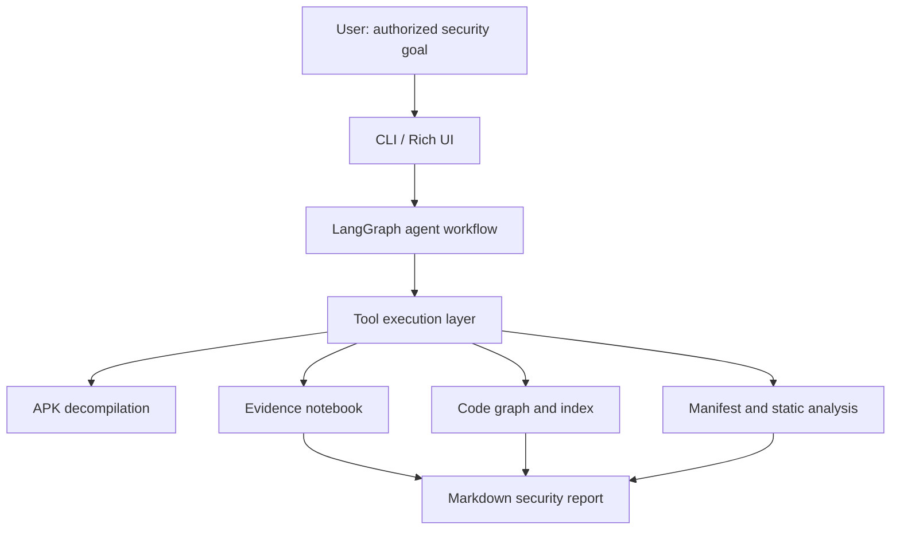

<p align="center">
  
  
  
  
  
</p>

<h1 align="center">🧠 APK AGI</h1>

<p align="center">
  
</p>

<h3 align="center">
  AI-Assisted Android Application Security Analysis Toolkit
</h3>

<p align="center">
  <em>
    An open-source research and education project for authorized Android APK analysis, static security review, code graph exploration, and forensic reporting.
  </em>
</p>

<p align="center">
  <a href="#-purpose">Purpose</a> •
  <a href="#-responsible-use">Responsible Use</a> •
  <a href="#-features">Features</a> •
  <a href="#%EF%B8%8F-architecture">Architecture</a> •
  <a href="#-getting-started">Getting Started</a> •
  <a href="#-roadmap">Roadmap</a>
</p>

---

## 🎯 Purpose

**APK AGI** is an MIT-licensed open-source project focused on **responsible Android application security analysis**.

The project combines established Android reverse-engineering tools with an AI-assisted workflow to help students, developers, and security researchers understand how Android applications are structured and how common security issues can be identified in authorized environments.

APK AGI is designed for:

- **Students** learning Android security, reverse engineering, and secure software development
- **Developers** reviewing their own APKs before release
- **Security researchers** performing authorized static analysis
- **Educators** creating practical mobile security labs
- **Open-source contributors** exploring agentic workflows for developer tooling

> Maintainer note: this project is maintained by an IT student as a learning-focused open-source effort to make Android security analysis more accessible, transparent, and responsible.

---

## 🔐 Responsible Use

APK AGI must only be used for **legal, ethical, and authorized security work**.

### Allowed use cases

- Testing Android applications you own
- Auditing APKs with explicit written permission
- Academic security labs and coursework
- Bug bounty research within the published scope
- Defensive analysis of malware samples in a controlled lab
- Understanding Android app internals for education

### Not allowed

This project must not be used for:

- Piracy, cracking, or unauthorized modification of third-party apps
- Bypassing payments, subscriptions, licensing, DRM, or access controls
- Removing ads from apps you do not own
- Circumventing security protections without permission
- Repackaging or redistributing modified APKs without authorization
- Any activity that violates laws, platform policies, or software licenses

APK AGI is a security education and research tool, not a piracy or abuse tool. Any patching or rebuild functionality is intended only for owned applications, controlled labs, or explicitly authorized assessments.

---

## ✨ Features

### Core capabilities

| Category | Capability |
|:--|:--|
| **APK Decompilation** | Uses tools such as apktool, JADX, and dex2jar to inspect APK structure, Smali, Java-like output, and JAR artifacts |
| **Manifest Review** | Parses permissions, exported components, intent filters, network security settings, and application metadata |
| **Static Security Analysis** | Detects common security patterns such as weak crypto usage, hardcoded secrets, unsafe WebView settings, logging leaks, dynamic code loading, and insecure network configuration |
| **Code Graph Exploration** | Builds a NetworkX-powered graph for class, method, caller, callee, and path exploration |
| **Code Indexing** | Creates searchable indexes for classes, methods, strings, packages, and relevant artifacts |
| **String & Secret Review** | Classifies URLs, API-like tokens, Base64 strings, Firebase-style references, and other suspicious constants |
| **Native & Hybrid App Review** | Identifies JNI usage, native library loading, Flutter/React Native bridges, and native binary inventory |
| **Evidence Notebook** | Stores findings with severity, category, context, and notes so long sessions remain auditable |
| **Human-in-the-Loop Review** | High-impact changes should be previewed and approved before being applied |
| **Report Generation** | Produces Markdown reports with findings, methodology, limitations, and evidence summaries |

### AI-assisted workflow

APK AGI uses an agentic loop to help organize long security-analysis sessions:

1. Understand the user’s authorized analysis goal
2. Plan the investigation steps
3. Run decompilation and static-analysis tools
4. Save findings and evidence
5. Build code graph and indexes
6. Review possible risks and limitations
7. Generate a reproducible report

The AI workflow is intended to assist human reviewers. It does not replace professional judgment, manual validation, or legal authorization.

---

## 🧭 Safety Model

APK AGI follows an **analysis-first** design philosophy.

### Current safeguards

- Clear responsible-use policy in this README
- Evidence logging for traceability
- Human review flow for high-impact changes
- Report sections for limitations and assumptions
- Intended-use boundaries for education and authorized testing

### Planned safeguards

- `SAFE_MODE=analysis_only` to disable patch/build actions by default
- Project scope files to restrict allowed APK hashes, package names, and paths
- Stronger warnings before any modification or rebuild operation
- CI tests for security-sensitive tools
- SHA256 verification for downloaded external tools
- Smaller modular tool files for easier review
- Example intentionally vulnerable APK lab for safe demonstrations

---

## 🏗️ Architecture



### Main components

| Component | Role |
|:--|:--|
| `src/apk_agent/cli.py` | Interactive command-line interface |
| `src/apk_agent/config.py` | Environment and tool configuration |
| `src/apk_agent/agent/graph.py` | LangGraph state machine and routing |
| `src/apk_agent/agent/tools_def.py` | Tool registration layer |
| `src/apk_agent/tools/` | Android analysis, graph, evidence, reporting, and build helpers |
| `scripts/setup_tools.py` | Helper script for external tool setup |
| `Dockerfile` | Containerized environment for reproducible usage |

---

## 🔧 Tooling

APK AGI integrates with widely used Android and Python ecosystem tools.

### Android tooling

| Tool | Purpose |
|:--|:--|
| apktool | APK resource decoding, Smali disassembly, and rebuild support |
| JADX | DEX to Java-like source decompilation |
| dex2jar | DEX to JAR conversion for JVM-level inspection |
| Android SDK Build Tools | `aapt2`, `zipalign`, and `apksigner` support |

### Python and AI tooling

| Library | Purpose |
|:--|:--|
| LangGraph | Agentic state machine and workflow control |
| LangChain | LLM abstraction and tool binding |
| NetworkX | Code graph construction and traversal |
| Rich | Terminal UI and formatted output |
| Click | CLI argument parsing |
| python-dotenv | `.env` configuration loading |
| PyYAML | YAML parsing |

---

## 🚀 Getting Started

### Prerequisites

- Python 3.11+
- Java JDK/JRE 11+
- Android SDK Build Tools for signing and alignment features
- An LLM API key from a provider compatible with the project configuration

### Installation

```bash
git clone https://github.com/amenallahbarkaoui-github/APK_AGI.git
cd APK_AGI
pip install -e .
python scripts/setup_tools.py
```

### Configuration

Create a `.env` file in the project root:

```env
API_KEY=your-api-key-here
API_BASE_URL=https://your-compatible-provider.example/v1
MODEL_NAME=your-model-name

# Optional external tool overrides
# APKTOOL_PATH=tools/bin/apktool.jar
# JADX_PATH=tools/bin/jadx/bin/jadx
# APKSIGNER_PATH=tools/bin/build-tools/apksigner
# ZIPALIGN_PATH=tools/bin/build-tools/zipalign
```

### Docker

```bash
docker build -t apk-agi .
docker run -it --env-file .env -v ./workspace:/workspace apk-agi
```

---

## 💡 Example Usage

### Start an authorized analysis

```bash
apk-agent path/to/owned-or-authorized-app.apk
```

### Example prompts

```text
Perform an authorized static security review of this APK and generate a report.
```

```text
Analyze the manifest, exported components, permissions, network security config, and hardcoded secrets.
```

```text
Build a code graph and identify security-relevant call paths for networking, WebView, cryptography, and dynamic loading.
```

```text
Generate a Markdown report with findings, evidence, severity, limitations, and recommended remediation steps.
```

---

## 📄 Reporting Output

APK AGI can generate Markdown reports intended for education and authorized security review.

A typical report includes:

- Executive summary
- Scope and authorization notes
- Tools and methodology
- Manifest and permission findings
- Network security observations
- Code graph insights
- Potential vulnerabilities
- Evidence references
- Limitations and false-positive notes
- Recommended remediation steps

---

## 🧪 Project Status

APK AGI is currently a **research preview**.

It is usable for experimentation and learning, but it should not be treated as a fully validated commercial security product. Findings should be manually reviewed before any security decision is made.

### Known improvement areas

- Add automated tests and CI workflows
- Add reproducible sample labs
- Split large tool definitions into smaller modules
- Improve documentation for each analysis tool
- Add checksums/signature verification for external binaries
- Standardize project versioning across README, CLI, and package metadata
- Improve safety controls around patching and rebuilding

---

## 🛣️ Roadmap

### Short term

- [ ] Add GitHub Actions for linting and tests
- [ ] Add `RESPONSIBLE_USE.md`
- [ ] Add `SECURITY.md`
- [ ] Add `CONTRIBUTING.md`
- [ ] Add safe sample APK lab documentation
- [ ] Add screenshots or demo GIFs of authorized analysis workflows

### Medium term

- [ ] Add `SAFE_MODE=analysis_only`
- [ ] Add scope validation for APK package names and hashes
- [ ] Add SHA256 verification for tool downloads
- [ ] Refactor tool definitions into smaller modules
- [ ] Add unit tests for parsers and scanners
- [ ] Add integration tests using intentionally vulnerable test APKs

### Long term

- [ ] Create educational Android security lessons
- [ ] Publish reproducible benchmark reports
- [ ] Support plugin-based tool extensions
- [ ] Improve graph-based vulnerability explanation
- [ ] Build a safer classroom/lab mode for instructors

---

## 🤝 Contributing

Contributions are welcome, especially in areas that improve safety, documentation, testing, and educational value.

Good first contribution areas:

- Documentation fixes
- Test cases
- Parser improvements
- Report templates
- Safe sample labs
- CI workflows
- Responsible-use safeguards

Before contributing, please keep the project’s purpose in mind: APK AGI exists to support **authorized security analysis and education**.

---

## 🛡️ Security Policy

If you discover a vulnerability in APK AGI itself, please open a GitHub issue with a minimal description that does not expose sensitive details, or contact the maintainer through the GitHub profile.

Do not submit real secrets, proprietary APKs, private keys, or unauthorized application samples to this repository.

---

## ⚖️ Legal and Ethical Notice

This repository is provided for educational and authorized security research only.

Users are responsible for complying with all applicable laws, software licenses, platform policies, and authorization requirements. The maintainer does not endorse or accept responsibility for misuse of this project.

If you are not sure whether you are allowed to analyze or modify an APK, do not use this tool on that APK.

---

## 📚 Credits and Attribution

APK AGI builds on the work of the Android security and open-source ecosystem, including:

- apktool
- JADX
- dex2jar
- Android SDK Build Tools
- LangGraph
- LangChain
- NetworkX
- Rich
- Click

Please refer to each upstream project for its license and documentation.

---

## 📄 License

This project is licensed under the MIT License. See the [LICENSE](LICENSE) file for details.

---

<p align="center">
  Built with ❤️ by <a href="https://github.com/amenallahbarkaoui-github">Amenallah Barkaoui</a>
</p>
